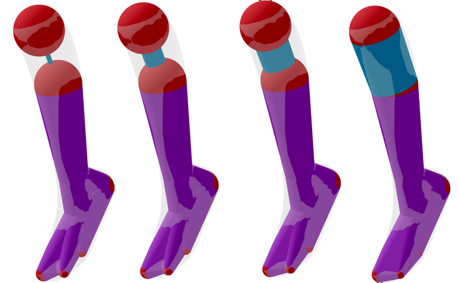

# Semi-Automated Generation of Sphere-Meshes from Triangular Meshes

## Overview

This study delves into the semi-automated generation of **timedSpheres-meshes** as high-quality approximations for given three-dimensional shapes. These shapes are originally represented as common triangular meshes.

A *timedSpheres-mesh* is a unique class of geometric proxy, defined as the volume swept by spheres with linearly interpolated centers and radii. It offers a balance between conciseness of representation, simplicity of spatial queries, expressive power, and is particularly suitable for animations.

## Problem Statement

Despite the favorable characteristics of timedSpheres-meshes, their broader adoption in fields like **video games**, **physical simulation**, or **robotics** is limited. This limitation is primarily due to the complexity involved in their construction, which remains a challenge in the field.

Existing fully automatic algorithms, based on interactive coarsening of the input mesh, often fail to produce satisfactory results, especially for very coarse timedSpheres-meshes.

## Our Contribution

We propose an improvement through a **3D interface** designed to allow users to easily and intuitively modify automatically generated models. This approach comprises two phases:

1. **Existing Automatic Algorithm:** Utilizes current methodologies for initial timedSpheres-mesh generation.
2. **Novel Interactive Tool:** Enables user intervention for refined adjustments and improvements.

Employing these two phases in cascade, we introduce a viable semi-automatic method to produce timedSpheres-meshes.

## Evaluation and Applications

We have tested our method on several input triangular meshes (tri-meshes), assessing their quality and overall performance. Further, we explore a few downstream applications to demonstrate the practicality and usability of our generated timedSpheres-meshes.

## Getting Started

In order to run the project, download the repository and run the cmake build task.
The code provided should run as is, as long as it has a starting triangular mesh to read.

## Contributing

If you want to contribute to the further developement of the project please send me a mail to davide.paolillo.uni@gmail.com or submit an issue with your request.

## License

MIT License

Copyright (c) [2024] [Davide Paolillo, Marco Tarini]

Permission is hereby granted, free of charge, to any person obtaining a copy
of this software and associated documentation files (the "Software"), to deal
in the Software without restriction, including without limitation the rights
to use, copy, modify, merge, publish, distribute, sublicense, and/or sell
copies of the Software, and to permit persons to whom the Software is
furnished to do so, subject to the following conditions:

The above copyright notice and this permission notice shall be included in all
copies or substantial portions of the Software.

THE SOFTWARE IS PROVIDED "AS IS", WITHOUT WARRANTY OF ANY KIND, EXPRESS OR
IMPLIED, INCLUDING BUT NOT LIMITED TO THE WARRANTIES OF MERCHANTABILITY,
FITNESS FOR A PARTICULAR PURPOSE AND NONINFRINGEMENT. IN NO EVENT SHALL THE
AUTHORS OR COPYRIGHT HOLDERS BE LIABLE FOR ANY CLAIM, DAMAGES OR OTHER
LIABILITY, WHETHER IN AN ACTION OF CONTRACT, TORT OR OTHERWISE, ARISING FROM,
OUT OF OR IN CONNECTION WITH THE SOFTWARE OR THE USE OR OTHER DEALINGS IN THE
SOFTWARE.

## Authors

- Davide Paolillo
- Marco Tarini

## Acknowledgments

A huge thank to Marco Tarini, my professor, which guided me through every challenge of this paper and for the immense patience shown towards me.

---

For more details about our research, please refer to our paper: [User-assisted Sphere-mesh Construction](https://diglib.eg.org/handle/10.2312/stag20231303)

